# CryptoPayServer

Receive cryptocurrency payments with ease, free, open-source, and self-hosted cryptocurrency payment processor.

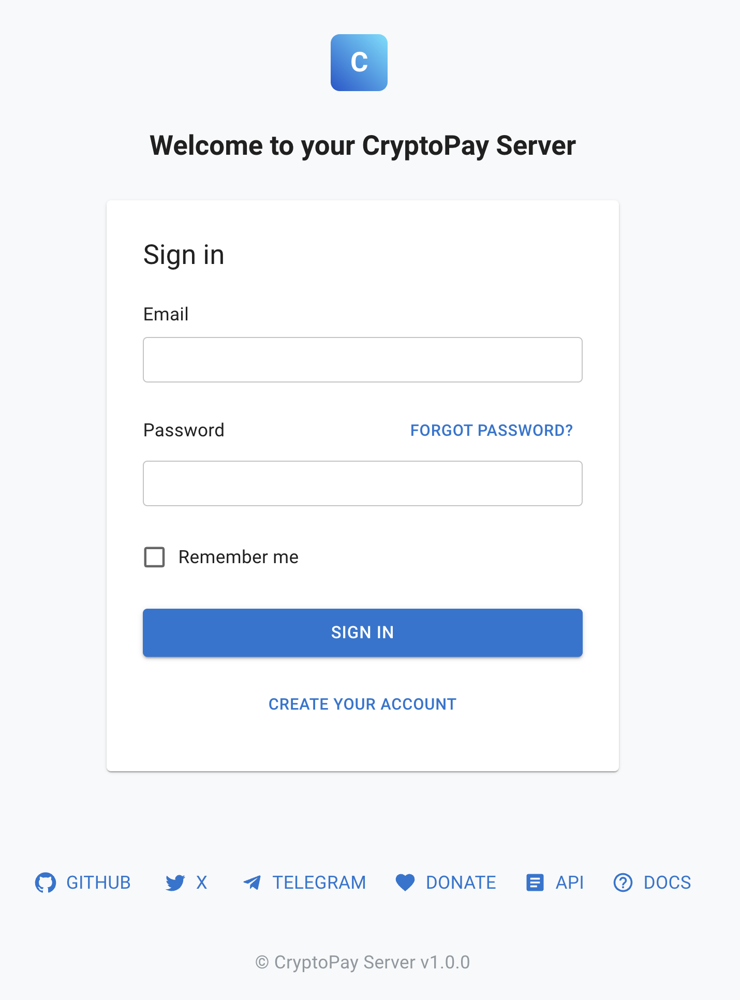
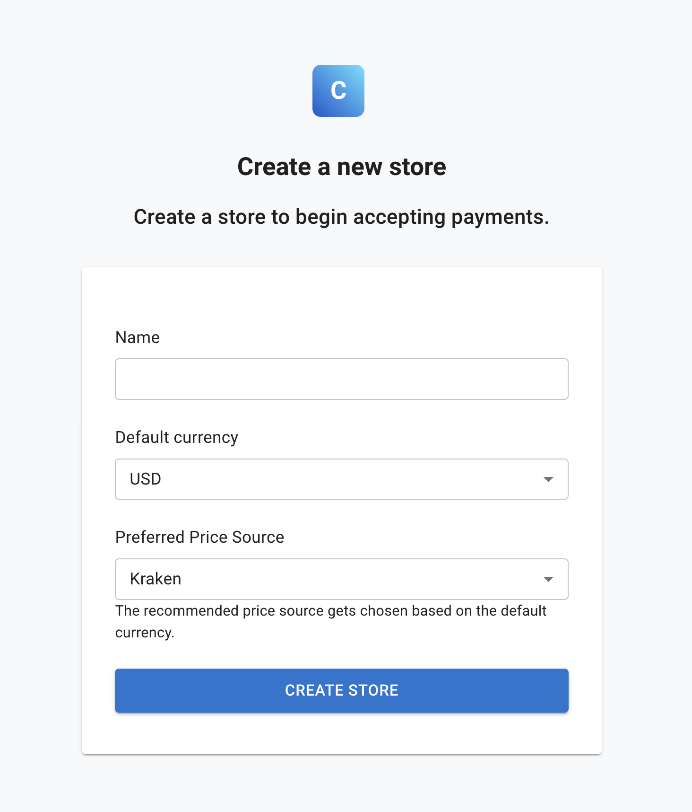
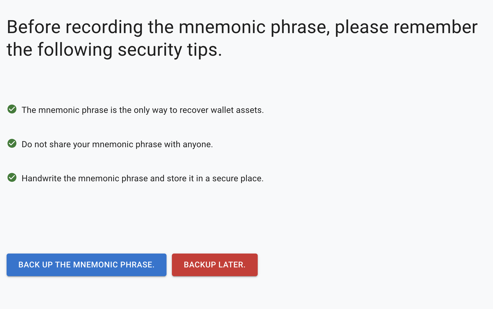
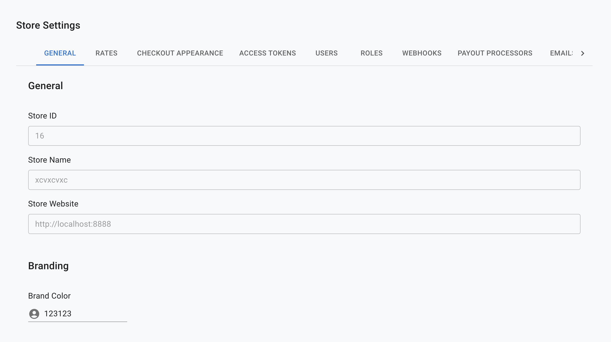
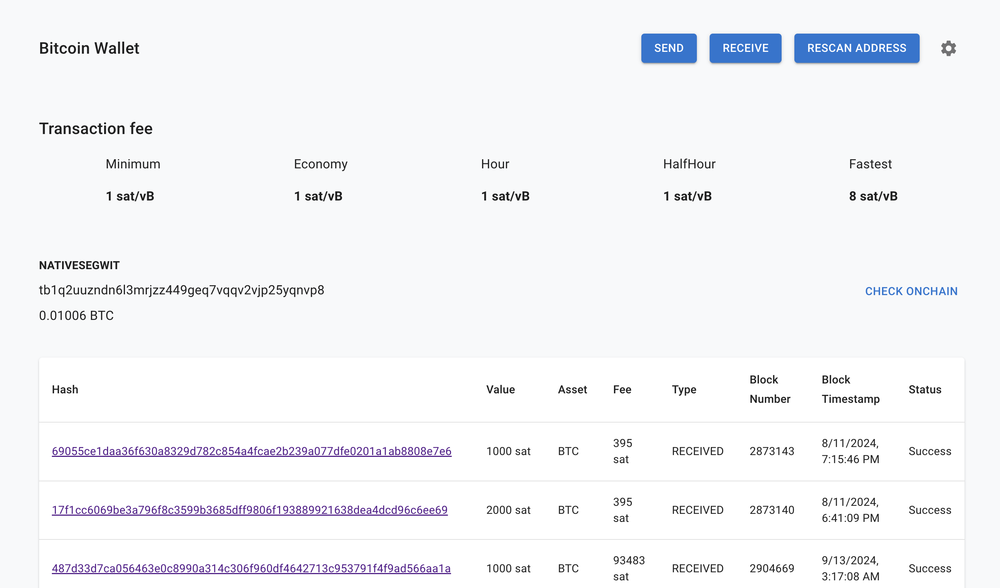
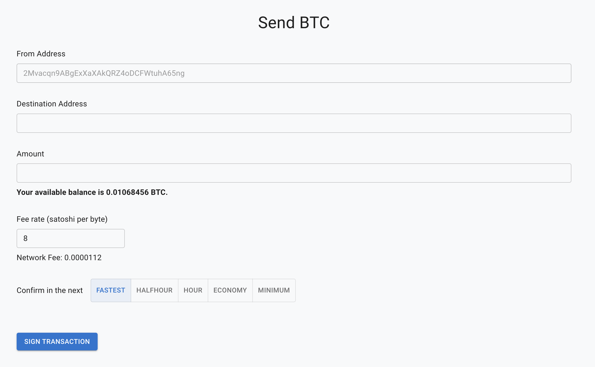
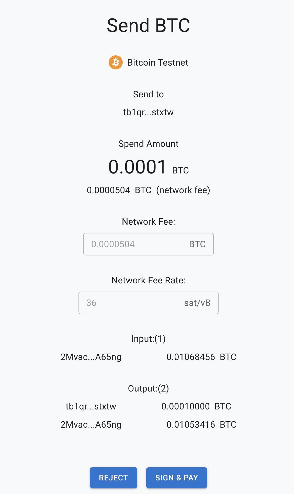
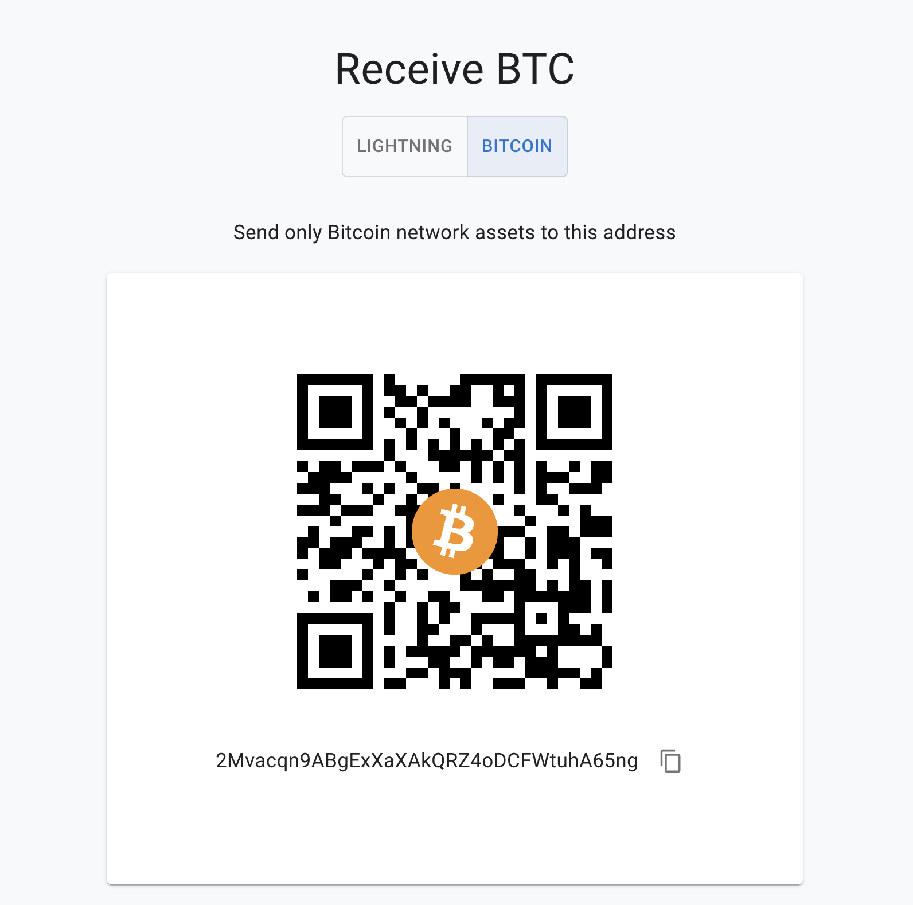
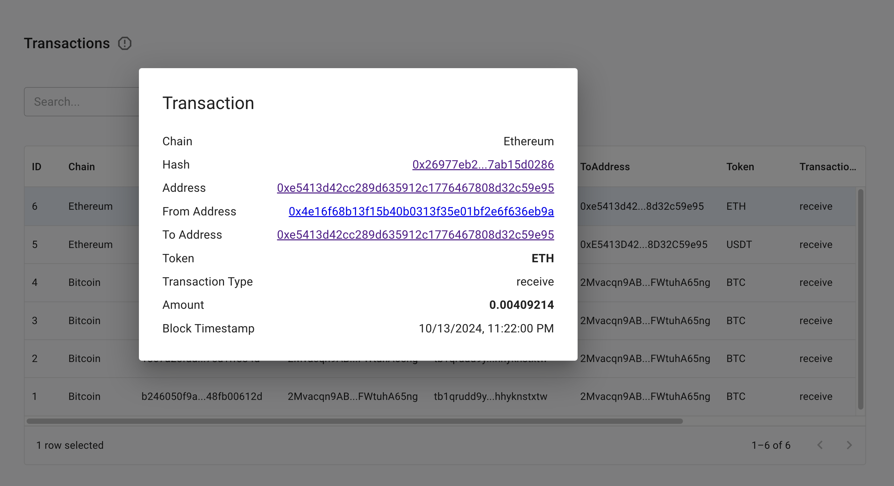
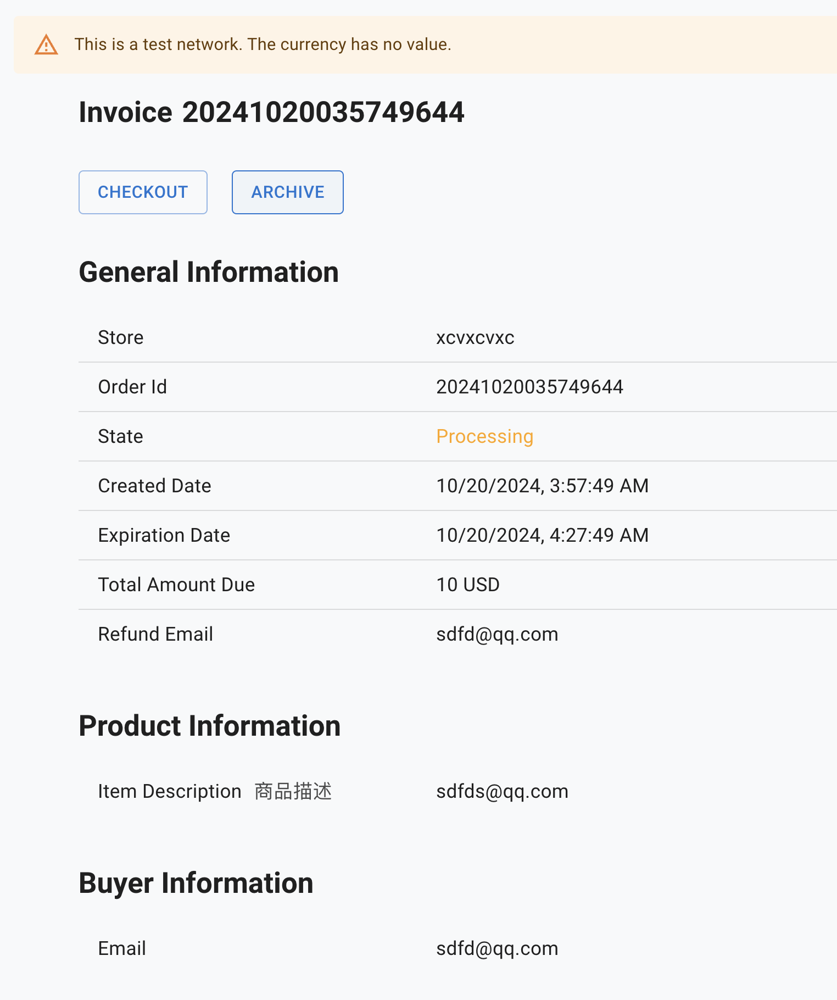
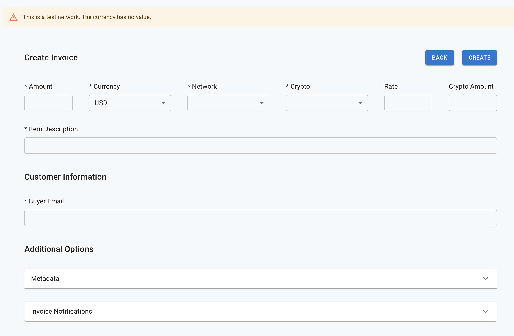
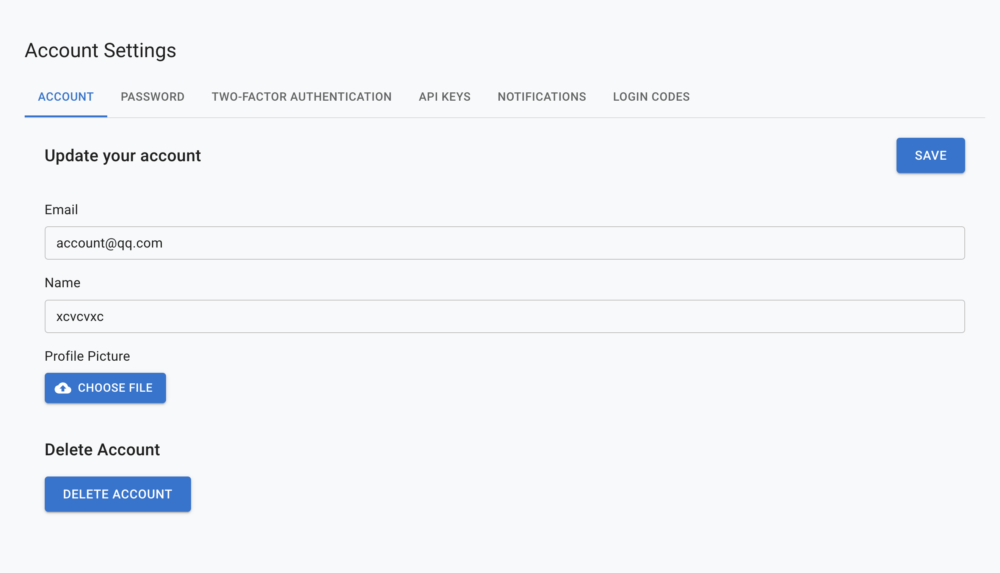

## Table of Contents

- [Overview](#overview)
- [Main Features](#main-features)
- [Supported Chains](#supported-chains)
- [Creating a Wallet](#creating-a-wallet)
- [Creating a Store](#creating-a-store)
- [Switching Stores](#switching-stores)
- [System Notifications](#system-notifications)
- [Dashboard](#dashboard)
- [Store Settings](#store-settings)
- [Wallet Management](#wallet-management)
- [Plugin Settings](#plugin-settings)
- [Account Settings](#account-settings)
- [Product List](#product-list)
- [Checkout Page](#checkout-page)
- [Additional Features](#additional-features)
- [License](#license)

## Overview

CryptoPayServer is a cryptocurrency payment processor designed to be free, open-source, and self-hosted. It allows merchants to receive cryptocurrency payments with support for multiple blockchains and cryptocurrencies.

## Main Features

- **Supported Chains**
- **Create Wallet**
- **Create Store**
- **Switch Store**
- **System Notifications**
- **Dashboard**
- **Store Settings**
- **Wallet Management**
- **Plugin Settings**
- **Account Settings**
- **Product List**
- **Checkout Page**
- **Additional Features**

## Supported Chains

1. Bitcoin(Bitcoin Lightning Network)
2. Ethereum
3. Solana
4. Binance Smart Chain
5. Litecoin
6. Base
7. XRP
8. Ton
9. Tron
10. etc...

## Creating a Wallet

1. Create addresses for different chains using a mnemonic phrase, with support for import and export.
2. Default support for major chains and popular cryptocurrencies.
3. Customizable support for additional chains and currencies.

## Creating a Store

1. Each wallet has at least one mnemonic phrase.
2. Enter basic store information, create a store, and start receiving payments from users.

## Switching Stores

1. Supports switching between multiple stores.
2. Each store has its own unique theme.

## System Notifications

1. Provides and enables default notification types.
2. Receive in-app system notifications, including version updates, transactions, order completions, etc.

## Dashboard

1. Track daily order counts, transaction volumes, sales figures, etc.
2. View the current status of the store intuitively.

## Store Settings

1. Set up basic store information.
2. Add store SEO attributes.
3. Enhance store security.

## Wallet Management

1. View current wallet balance and manage asset transfers.
2. View balance information for addresses on different chains.
3. View gas fees for sending transactions.
4. View private keys and other sensitive information.

## Plugin Settings

1. Support for external e-commerce platform plugin settings.
2. Connect to external service providers.
3. Support for small apps.
4. Plugin services supported: Shopify, Point of Sale, Pay Button, and Crowdfund.

## Account Settings

1. Manage personal account information.
2. Modify personal settings.
3. Manage security measures.
4. Two-factor authentication.
5. API request authentication.
6. Notification management, with options to enable or disable by category.
7. Login codes.

## Product List

1. List and delist products.
2. Enter and modify basic product information.
3. Share products.
4. Purchase products.

## Checkout Page

1. Select payment currency.
2. View payment QR code.
3. Support Web3 payment processes.
4. Support third-party payment wallets.
5. Optimize payment process settings and feedback.

## Additional Features

1. Exchange rate services.
2. Currency pair services.
3. Email services.
4. Automation services.
5. Testnet and mainnet switching.
6. Scanner block services.

## License

CryptoPayServer's software, logo, and design are provided under the MIT License.
